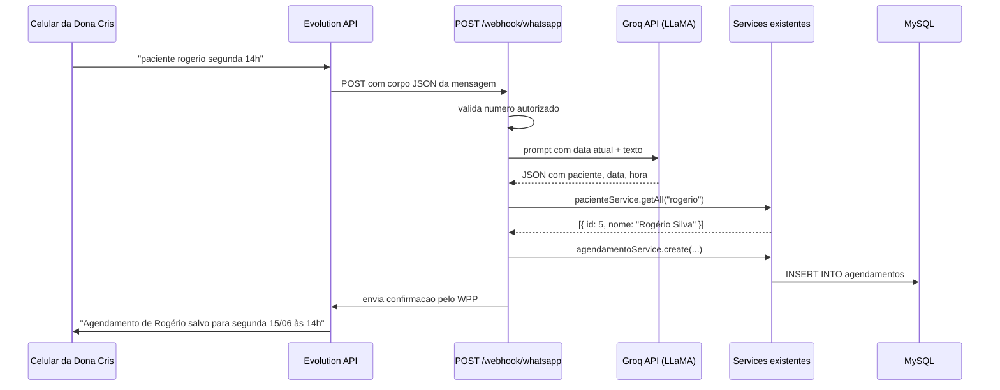

# Plano: Agendamento via WhatsApp + IA

## Fluxo geral



## Arquivos novos (apenas no server/)

- `server/src/routes/whatsapp.js` — registra `POST /webhook/whatsapp`
- `server/src/controllers/whatsappController.js` — recebe e orquestra o fluxo
- `server/src/services/whatsappParserService.js` — chama Groq e retorna JSON estruturado

## Arquivo modificado

- [`server/index.js`](server/index.js) — adicionar o import e `app.use("/webhook", whatsappRoutes)`
- [`server/package.json`](server/package.json) — adicionar dependência `groq-sdk`

## Detalhes de cada parte

### 1. Dependência

```
npm install groq-sdk --prefix server
```

Groq é gratuito, suporta LLaMA 3.1 8B, e tem API compatível com OpenAI SDK.

### 2. `whatsappParserService.js`

Monta um prompt que inclui a data/hora atual do sistema (essencial para resolver "segunda-feira"). Envia para Groq e pede resposta em JSON com:
- `intencao`: `"agendar"` | `"cancelar"` | `"desconhecido"`
- `paciente`: string com o nome
- `data`: formato `YYYY-MM-DD`
- `hora`: formato `HH:MM`

Se qualquer campo estiver faltando, retorna `null` naquele campo.

### 3. `whatsappController.js`

Orquestra o fluxo:
1. Lê o número do remetente e valida contra `NUMERO_AUTORIZADO` (variável de ambiente)
2. Chama `whatsappParserService` com o texto
3. Chama `pacienteService.getAll(nome)` para buscar o paciente
4. Trata ambiguidade: se 0 ou 2+ resultados, responde pedindo correção
5. Monta `data_hora` como `YYYY-MM-DDTHH:MM:00`
6. Chama `agendamentoService.create(...)` com `profissional_id: 1` (mesmo padrão atual do frontend)
7. Chama a Evolution API para enviar a mensagem de resposta

### 4. Variáveis de ambiente

Será necessário criar um `.env` na pasta `server/` com:

```
GROQ_API_KEY=sua_chave_aqui
EVOLUTION_API_URL=http://localhost:8080
EVOLUTION_API_KEY=sua_chave_aqui
EVOLUTION_INSTANCE=nome_da_instancia
NUMERO_AUTORIZADO=5548999999999
```

O `server/index.js` precisará carregar `dotenv` para ler essas variáveis.

### 5. Casos de resposta no WhatsApp

| Situação | Mensagem enviada de volta |
|----------|--------------------------|
| Sucesso | "Agendamento de Rogério Silva salvo para segunda, 15/06 às 14h." |
| Paciente não encontrado | "Não encontrei nenhum paciente com o nome 'Rogerio'. Cadastre primeiro no sistema." |
| Mais de 1 paciente | "Encontrei mais de um paciente com esse nome. Seja mais específico." |
| Horário ocupado | "Este horário já está ocupado. Horários disponíveis: 13h, 15h, 16h." |
| Informação faltando | "Não entendi. Tente: *paciente Nome dia_da_semana hora*. Ex: paciente João segunda 14h" |
| Número não autorizado | (ignora silenciosamente) |

## Pré-requisito: Evolution API rodando

Antes de testar o webhook, é necessário:
1. Ter Docker instalado
2. Subir a Evolution API com `docker-compose`
3. Escanear o QR Code no WhatsApp da Dona Cris
4. Expor a porta 3001 com ngrok (`ngrok http 3001`) para que a Evolution API consiga chamar o webhook

Essa parte não é código — é configuração de infraestrutura, e posso documentar o passo a passo junto.
